# 🎬 Douyin Data Crawler

<div align="center">

**English** | [简体中文](README.md)

A Playwright-based Douyin (TikTok China) data collection and analysis platform

[](https://www.python.org/)
[](https://vuejs.org/)
[](https://fastapi.tiangolo.com/)
[](https://playwright.dev/)
[](LICENSE)

[Features](#-features) • [Quick Start](#-quick-start) • [Documentation](#-documentation) • [Deployment](#-deployment) • [Development](#-development-guide)

</div>

---

## 📖 Project Overview

**Douyin Data Crawler** is a feature-complete data collection and analysis platform designed specifically for the Douyin platform. Through browser automation technology, it enables collection of user, video, comment, and other data, while providing an intuitive Web management interface and MCP (Model Context Protocol) service interface.

### 🎯 Core Capabilities

- **User Data Collection** - Collect user profiles, follower data, and work lists
- **Video Data Collection** - Collect detailed information and interaction data for videos/image posts
- **Comment Data Collection** - Support complete comment tree collection, including all sub-replies
- **Media File Download** - Download videos, cover images, and image post files locally
- **Speech Recognition** - Automatic video speech-to-text conversion (based on faster-whisper)
- **Smart Search** - Local-first search to reduce unnecessary network requests
- **Scheduled Tasks** - Configure automatic periodic user data synchronization
- **MCP Service** - Provide tool interfaces directly callable by AI clients

### ✨ Technical Highlights

- 🛡️ **19 Anti-Detection Measures** - Browser fingerprint spoofing, request delays, automatic CAPTCHA detection
- 📊 **Complete Data Pipeline** - End-to-end flow from collection to storage to presentation
- 🔄 **Async Task Queue** - Task management with priority, pause, and retry support
- 🌐 **Dual Interface Design** - REST API + MCP Server for different scenarios
- 📱 **Responsive Design** - Web interface supporting both desktop and mobile
- 🔒 **Data Security** - Local SQLite storage with complete data ownership

---

## 🏗️ System Architecture

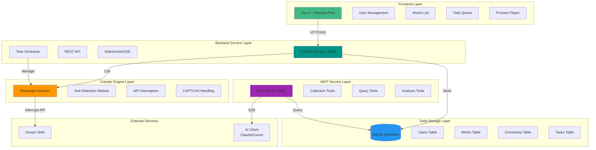

---

## 🚀 Features

### 📊 Data Collection Capabilities

| Feature Type | Collection Content | Support Scope |
|-------------|-------------------|--------------|
| **User Profile** | Nickname, avatar, follower count, following count, like count, Douyin ID | Full Collection |
| **Works List** | Video/image posts, title, cover, publish time, interaction data | Paginated Collection |
| **Comment Data** | Comment content, user info, like count, reply tree structure | Complete Comment Tree |
| **Media Files** | Video files, cover images, image post files | Local Download |
| **Speech Recognition** | Video speech to text | faster-whisper |

### 🎨 Web Management Interface

#### Core Pages

1. **System Dashboard**

   Global monitoring panel displaying real-time system status.

   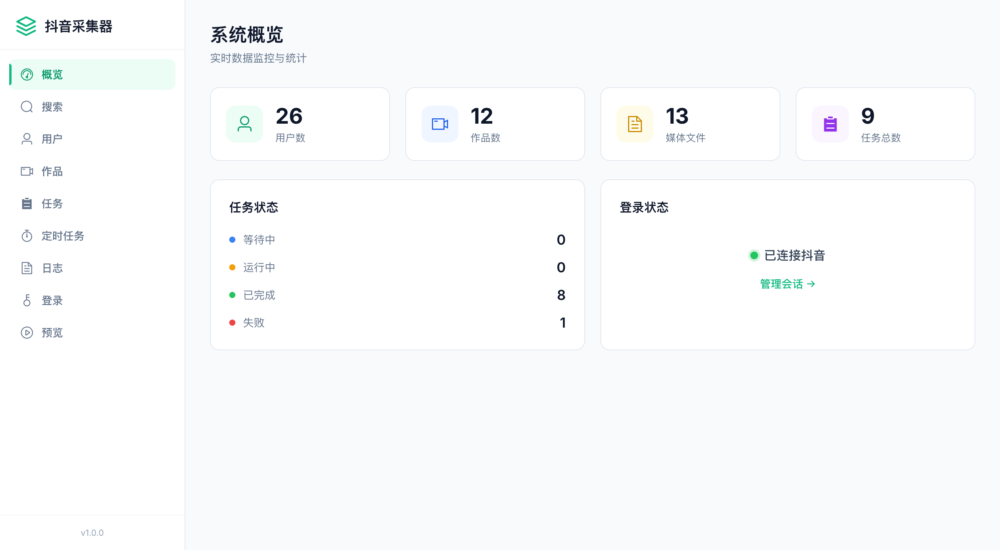

   **Key Features:**
   - Global statistics (users, works, comments, media counts)
   - Task status distribution visualization
   - Login status and CAPTCHA status monitoring

2. **Search Users**

   Discover new users from Douyin search.

   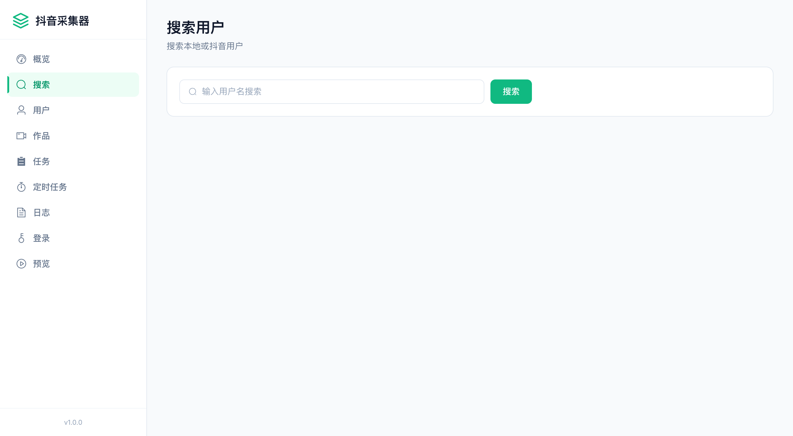

   **Key Features:**
   - Search Douyin users by keyword
   - Local-first matching for already collected users
   - Directly initiate collection tasks

3. **User Management**

   Manage collected user data.

   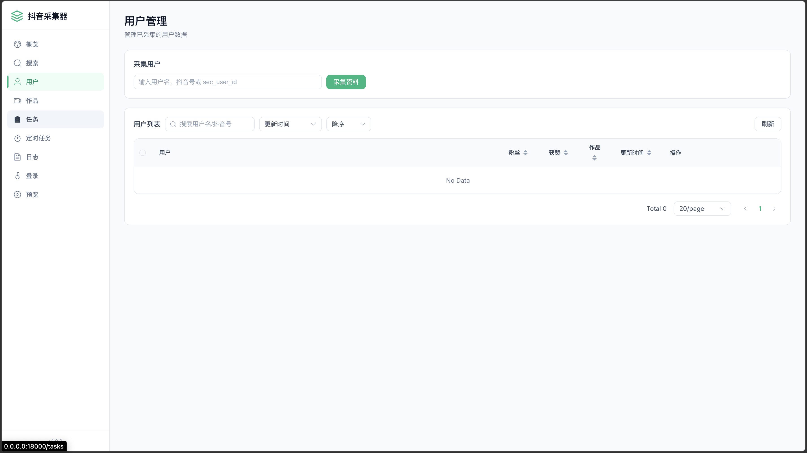

   **Key Features:**
   - User search and collection
   - User list management (search, details, update, delete)
   - Batch operation support

4. **Works List**

   Browse and manage collected work data.

   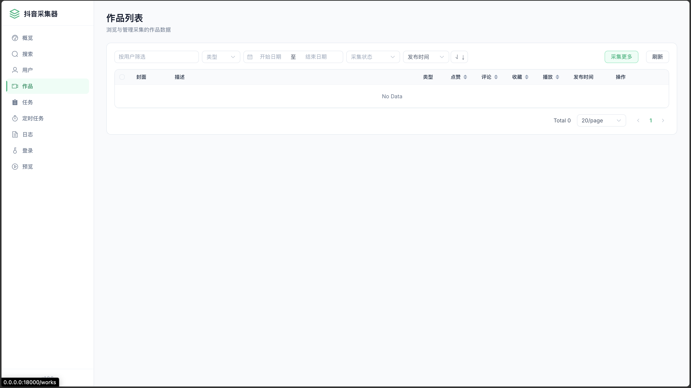

   **Key Features:**
   - Multi-dimensional filtering (user, type, time range)
   - Work detail viewing (video playback, image carousel)
   - Comment tree display
   - Batch re-collection

5. **Preview Player**

   Douyin-style vertical scrolling video playback experience.

   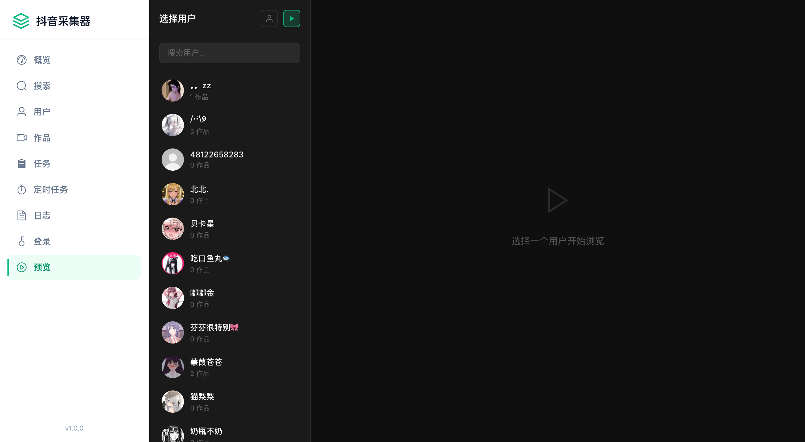

   **Key Features:**
   - 🆕 **Dual Mode Switching**: Single user mode / Global Feed mode
   - 🆕 **Audio Control**: Volume toggle button
   - Douyin-style vertical scrolling experience
   - Interaction features (like, favorite, comment)

6. **Task Queue**

   Real-time monitoring and management of all collection tasks.

   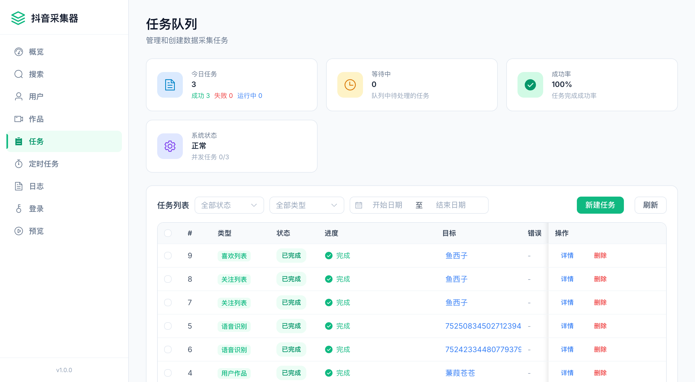

   **Key Features:**
   - Real-time task status monitoring
   - Task priority adjustment
   - Pause/Resume/Cancel operations
   - Batch management

7. **Scheduled Tasks**

   Configure automatic periodic user data synchronization.

   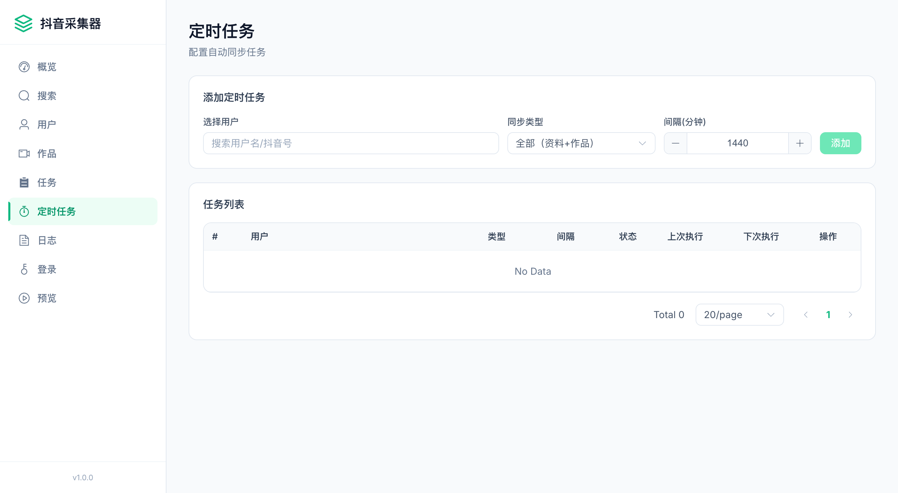

   **Key Features:**
   - Automatic periodic user data sync
   - Flexible execution interval configuration
   - Enable/Disable control

8. **Server Logs**

   View backend runtime logs in real-time.

   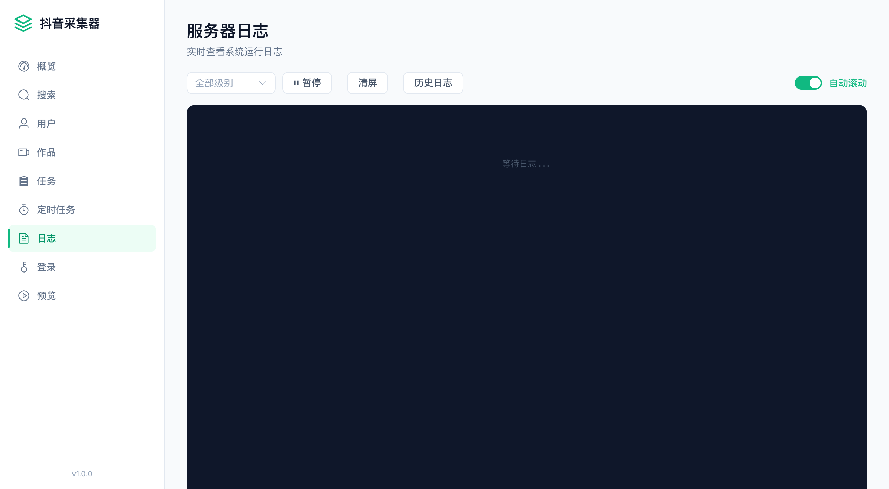

   **Key Features:**
   - Real-time log streaming (SSE)
   - Log level filtering
   - Historical log loading

9. **Session Management**

   Manage Douyin account login status.

   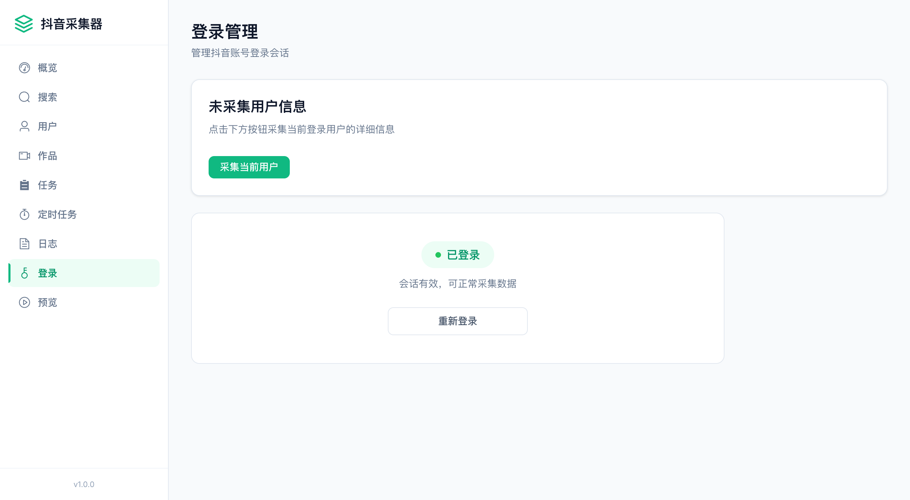

   **Key Features:**
   - QR code login
   - Automatic cookie saving
   - Login status monitoring

### 🔌 MCP Service Interface

The MCP Server provides 8 tool interfaces for direct AI client invocation:

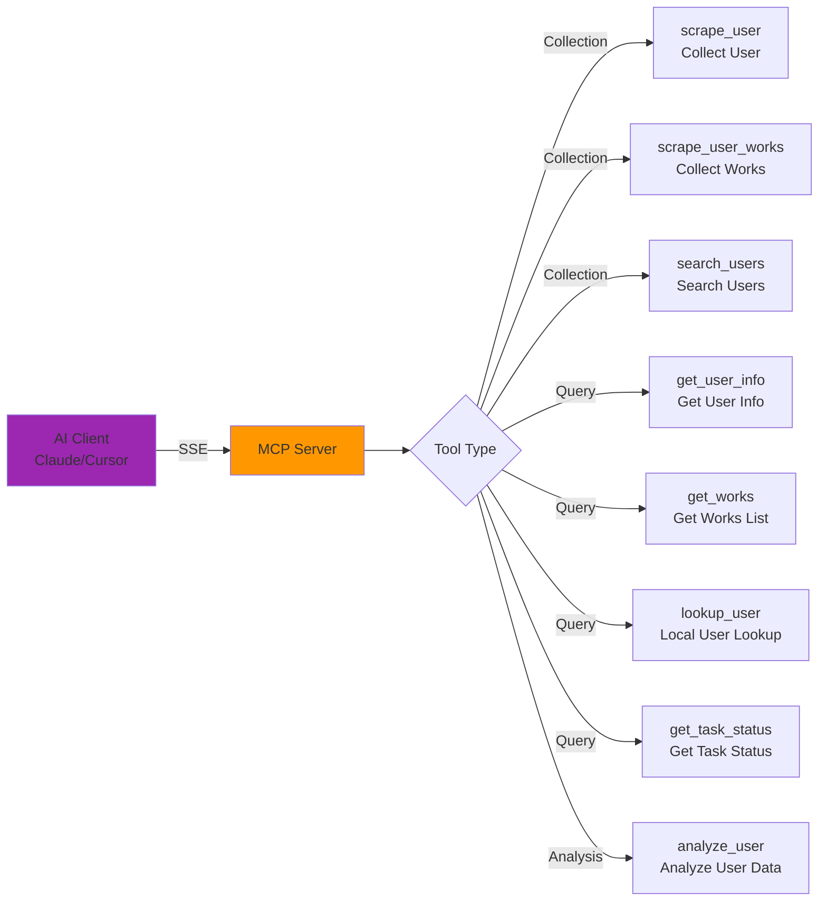

#### MCP Tool Details

| Tool Name | Function | Key Parameters |
|-----------|----------|---------------|
| `scrape_user` | Collect user data | `identifier` (sec_user_id/douyin_id/nickname), `sync_type` (all/profile/works) |
| `scrape_user_works` | Collect user works | `sec_user_id`, `max_pages` |
| `search_users` | Search Douyin users | `keyword` |
| `get_user_info` | Query user information | `user_id` (supports uid or sec_user_id) |
| `get_works` | Query works list | `uid`, `type`, `sort_by`, `has_media`, `has_comments`, etc. |
| `lookup_user` | Local user lookup | `keyword` |
| `get_task_status` | Query task status | `task_id` |
| `analyze_user` | Analyze user data | `sec_user_id` |

---

## 📦 Installation & Deployment

### Requirements

- **Python**: 3.11+
- **Node.js**: 18+
- **Operating System**: macOS / Linux
- **Optional**: ffmpeg (required for speech recognition, macOS: `brew install ffmpeg`)

### Quick Start

#### 1. Clone Project

```bash
git clone <repository-url>
cd titok-crawl
```

#### 2. Install Dependencies

```bash
# Create and activate virtual environment
python3 -m venv .venv
source .venv/bin/activate

# Install Python dependencies
pip install -r requirements.txt

# Install Playwright browser
playwright install chromium

# Install frontend dependencies
cd frontend && npm install && cd ..
```

#### 3. Start Services

**One-click Start (Recommended):**

```bash
./run.sh              # Normal mode (with GUI browser)
./run.sh --headless   # Headless mode (server deployment)
```

**Manual Start:**

```bash
# Terminal 1: Start backend
source .venv/bin/activate
python -m backend.main

# Terminal 2: Start frontend
cd frontend && npm run dev
```

#### 4. Access Services

| Service | URL | Description |
|---------|-----|-------------|
| **Web Management Interface** | http://localhost:5173 | Vue development server |
| **Backend API** | http://localhost:8000 | FastAPI service |
| **API Documentation** | http://localhost:8000/docs | Swagger UI |
| **MCP SSE** | http://localhost:8001/sse | MCP service endpoint |
| **Database Browser** | http://localhost:8002 | Datasette |

### Docker Deployment

```bash
# Start all services with one command
docker-compose up -d

# View logs
docker-compose logs -f

# Stop services
docker-compose down
```

**Docker Deployment Features:**
- Nginx unified gateway (single port 80)
- Automatic frontend static file build
- Data persistence to `./data` directory

| Path | Service |
|------|---------|
| `/` | Frontend Web Interface |
| `/api/` | Backend FastAPI |
| `/docs` | API Documentation |
| `/mcp/` | MCP SSE |
| `/media/` | Media Files |
| `/datasette/` | Database Browser |

---

## 📚 Core Features Deep Dive

### User Collection Flow

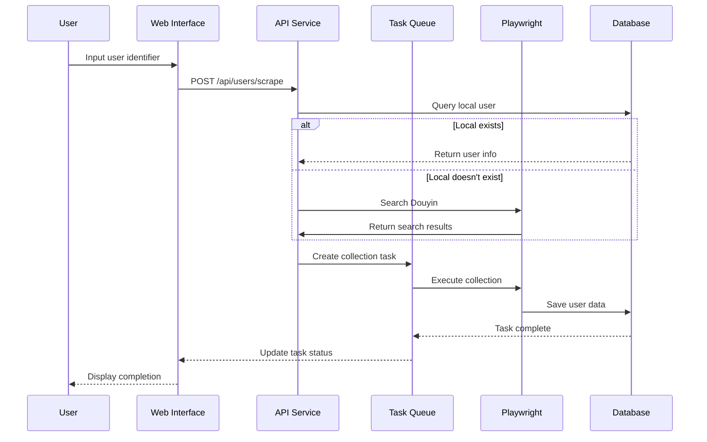

### Work Collection Flow

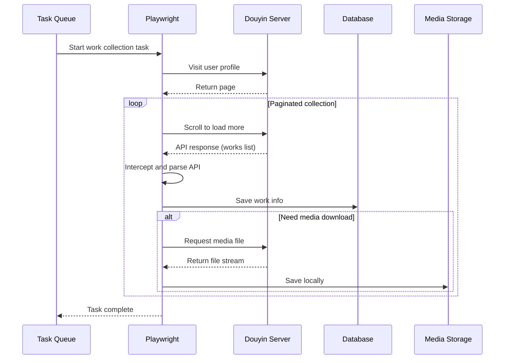

### REST API Endpoints

#### User Related

```http
# Scrape user
POST /api/users/scrape
Content-Type: application/json

{
  "identifier": "username/douyin_id/sec_user_id",
  "sync_type": "all"  # all/profile/works
}

# Get user list
GET /api/users?page=1&size=20&keyword=xxx

# Get user details
GET /api/users/{user_id}  # Supports uid or sec_user_id

# Delete user
DELETE /api/users/{user_id}?cascade=false
```

#### Work Related

```http
# Get works list
GET /api/workds?uid=xxx&type=video&page=1&size=20&sort_by=publish_time&sort_order=DESC

# Get work details
GET /api/works/{aweme_id}

# Re-scrape work
POST /api/works/{aweme_id}/rescrape
Content-Type: application/json

{
  "sync_types": ["comments", "media"]
}
```

#### Task Related

```http
# Get task list
GET /api/tasks?status=running&page=1&size=20

# Pause task
POST /api/tasks/{task_id}/pause

# Resume task
POST /api/tasks/{task_id}/resume

# Cancel task
DELETE /api/tasks/{task_id}
```

---

## 🛠️ Development Guide

### Project Structure

```
titok-crawl/
├── backend/                 # Backend code
│   ├── api/                # REST API routes
│   │   ├── users.py       # User endpoints
│   │   ├── works.py       # Work endpoints
│   │   ├── tasks.py       # Task endpoints
│   │   └── ...
│   ├── db/                 # Database layer
│   │   ├── database.py    # Database connection
│   │   ├── crud.py        # CRUD operations
│   │   └── models.py      # Data models
│   ├── scraper/            # Crawler engine
│   │   ├── engine.py      # Playwright engine
│   │   ├── user_scraper.py
│   │   ├── work_scraper.py
│   │   └── ...
│   ├── queue/              # Task queue
│   │   ├── scheduler.py   # Task scheduler
│   │   └── task_types.py  # Task type definitions
│   ├── mcp/                # MCP service
│   │   └── server.py      # MCP Server implementation
│   ├── analysis/           # Data analysis
│   │   └── analyzer.py    # User data analysis
│   ├── config.py          # Configuration management
│   └── main.py            # Application entry
├── frontend/               # Frontend code
│   ├── src/
│   │   ├── views/         # Page components
│   │   │   ├── Dashboard.vue
│   │   │   ├── Users.vue
│   │   │   ├── Works.vue
│   │   │   ├── Preview.vue  # 🆕 Preview player page
│   │   │   └── ...
│   │   ├── components/    # Common components
│   │   ├── api/          # API client
│   │   └── ...
│   └── package.json
├── data/                   # Data directory
│   ├── db/                # SQLite database
│   ├── media/             # Media files
│   ├── logs/              # Log files
│   └── browser/           # Browser data
├── deploy/                 # Deployment config
│   ├── nginx.conf         # Nginx configuration
│   └── docker-compose.yml
├── run.sh                  # One-click start script
└── README.md
```

### Configuration

Main configuration file: `backend/config.py`

```python
class Settings:
    # Database
    DB_PATH = DATA_DIR / "db" / "douyin.db"

    # Server ports
    API_PORT = 18000      # REST API port
    MCP_PORT = 18001      # MCP SSE port

    # Browser configuration
    HEADLESS = False      # Headless mode

    # Request control
    MIN_DELAY = 3.0       # Minimum request delay
    MAX_DELAY = 6.0       # Maximum request delay

    # Concurrency control
    MAX_CONCURRENT_TASKS = 3          # Max concurrent tasks
    MAX_CONCURRENT_DOWNLOADS = 3      # Parallel downloads
    MAX_CONCURRENT_COMMENTS = 2       # Parallel comment collection
```

### Anti-Detection Measures

The system implements 19 anti-detection measures:

1. **WebDriver Property Hiding**
2. **Chrome Runtime Simulation**
3. **Canvas/WebGL/AudioContext Fingerprint Noise**
4. **UA Client Hints Spoofing**
5. **Random Request Delays**
6. **Random Wait Before/After Navigation**
7. **Auto Long Pause Every 3-5 Pages**
8. **Mouse Micro-Movement Simulation**
9. **document.hasFocus/visibilityState Spoofing**
10. **Automatic CAPTCHA Detection and Manual Handling**
11. ...and more

### Data Model

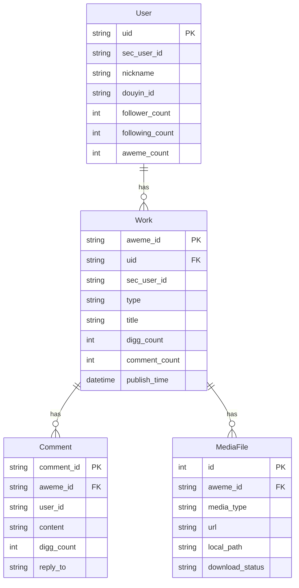

---

## 🔧 FAQ

### Q: What to do when CAPTCHA appears?

**A:** The system automatically detects CAPTCHA and pauses collection. You need to manually complete the verification in the popped browser window, after which collection will automatically resume. The Dashboard page shows current CAPTCHA status.

### Q: Why isn't headless mode the default?

**A:** Default `HEADLESS = False` is for:
- Easy manual CAPTCHA handling
- Easy QR code login
- Development debugging observation of collection process

For production, change to `HEADLESS = True`.

### Q: Collection speed is slow?

**A:** To avoid triggering anti-scraping, there's a 3-6 second delay between requests. You can adjust `MIN_DELAY` and `MAX_DELAY` in `backend/config.py`, but faster speeds increase ban risk.

### Q: Where is data stored?

**A:** All data is stored in the `data/` directory:
```
data/
├── db/douyin.db          # SQLite database
├── media/                # Media files
│   └── {sec_user_id}/
│       ├── videos/       # Video files
│       └── notes/        # Image post files
├── logs/app.jsonl        # Persistent logs
└── browser/              # Browser data
```

### Q: How to backup data?

**A:** Simply backup the `data/` directory, which contains the database and all media files.

---

## 🤝 Contributing

Contributions, issue reports, and suggestions are welcome!

1. Fork the project
2. Create a feature branch (`git checkout -b feature/AmazingFeature`)
3. Commit changes (`git commit -m 'Add some AmazingFeature'`)
4. Push to the branch (`git push origin feature/AmazingFeature`)
5. Open a Pull Request

---

## 📄 License

This project is licensed under the MIT License - see [LICENSE](LICENSE) file for details

---

## 🙏 Acknowledgments

- [Playwright](https://playwright.dev/) - Browser automation framework
- [FastAPI](https://fastapi.tiangolo.com/) - Modern web framework
- [Vue.js](https://vuejs.org/) - Progressive JavaScript framework
- [Element Plus](https://element-plus.org/) - Vue 3 UI component library
- [faster-whisper](https://github.com/guillaumekln/faster-whisper) - Efficient speech recognition

---

## 📚 Reference Projects

During development, this project referenced the following excellent open-source projects:

### [DouYin_Spider](https://github.com/cv-cat/DouYin_Spider) ⭐

**Author:** cv-cat

**Project Features:**
- Playwright-based Douyin data collection
- Complete user, video, and comment data collection solution
- Rich anti-detection experience and technical implementation
- Detailed data structures and API interception methods

**Inspiration:**
- Playwright browser automation best practices
- Douyin API interception and data parsing methods
- Anti-scraping strategy response approaches

---

### [MediaCrawler](https://github.com/NanmiCoder/MediaCrawler) ⭐

**Author:** NanmiCoder

**Project Features:**
- Supports multiple platforms including Douyin, Kuaishou, Xiaohongshu
- Complete Playwright-based crawler solution
- Media file download and storage solution
- Login management and Cookie persistence

**Inspiration:**
- Multi-platform crawler architecture design
- Media file download and management implementation
- Login state management and maintenance strategies
- Async task queue design concepts

---

Thank you to the authors of the above projects for their contributions to the open-source community! 🌟

---

<div align="center">

**⭐ If this project helps you, please give it a Star! ⭐**

Made with ❤️ by the community

</div>
