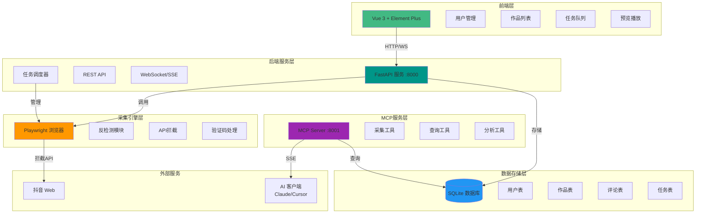
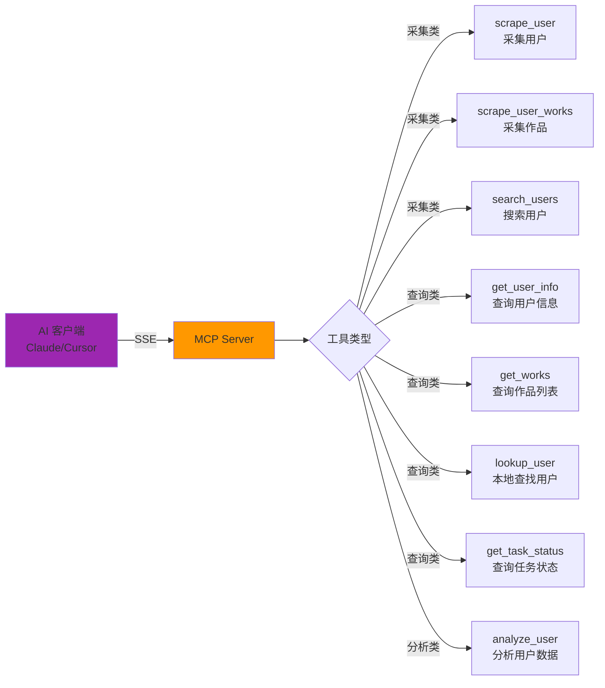
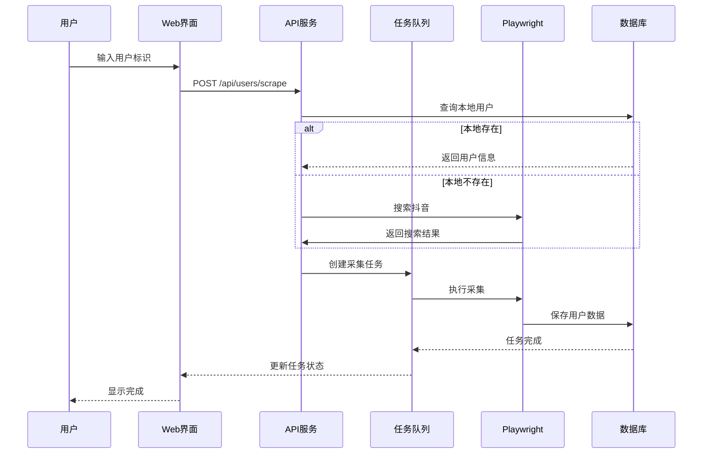
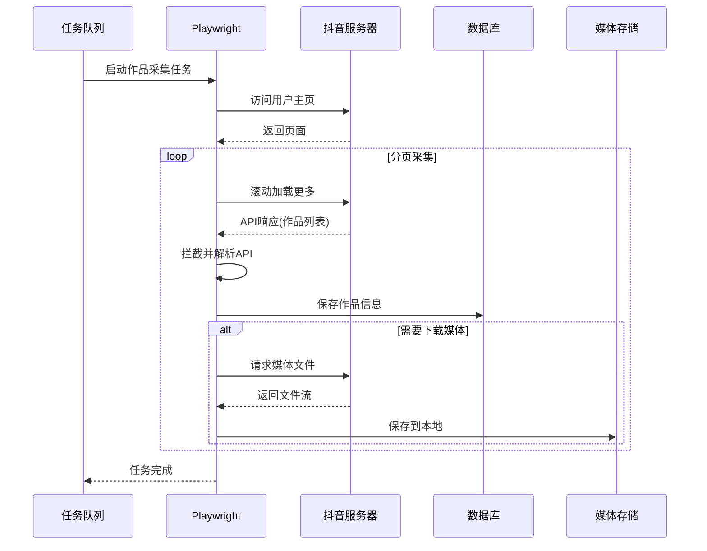
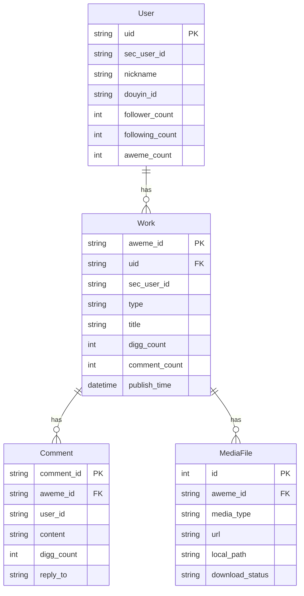

# 🎬 抖音数据采集器

<div align="center">

基于 Playwright 的抖音数据采集与分析平台

[](https://www.python.org/)
[](https://vuejs.org/)
[](https://fastapi.tiangolo.com/)
[](https://playwright.dev/)
[](LICENSE)

[功能特性](#-功能特性) • [快速开始](#-快速开始) • [文档](#-文档) • [部署](#-部署) • [开发](#-开发指南)

</div>

---

## 📖 项目简介

**抖音数据采集器** 是一个功能完整的数据采集与分析平台，专为抖音平台设计。通过浏览器自动化技术，实现对用户、作品、评论等数据的采集，并提供直观的 Web 管理界面和 MCP (Model Context Protocol) 服务接口。

### 🎯 核心能力

- **用户数据采集** - 采集用户资料、粉丝数据、作品列表
- **作品数据采集** - 采集视频/图文作品的详细信息、互动数据
- **评论数据采集** - 支持完整评论树的采集，包括所有子回复
- **媒体文件下载** - 下载视频文件、封面图、图文图片到本地
- **语音识别** - 视频语音自动转文字（基于 faster-whisper）
- **智能搜索** - 本地优先搜索，减少不必要的网络请求
- **定时任务** - 配置自动定期同步用户数据
- **MCP 服务** - 提供 AI 客户端可直接调用的工具接口

### ✨ 技术亮点

- 🛡️ **19项反检测措施** - 浏览器指纹伪装、请求延迟、验证码自动检测
- 📊 **完整的数据流** - 从采集到存储到展示的完整链路
- 🔄 **异步任务队列** - 支持优先级、暂停、重试的任务管理
- 🌐 **双接口设计** - REST API + MCP Server，满足不同场景
- 📱 **响应式设计** - 支持桌面端和移动端的 Web 界面
- 🔒 **数据安全** - 本地 SQLite 存储，数据完全自主可控

---

## 🏗️ 系统架构



---

## 🚀 功能特性

### 📊 数据采集能力

| 功能类型 | 采集内容 | 支持范围 |
|---------|---------|---------|
| **用户资料** | 昵称、头像、粉丝数、关注数、获赞数、抖音号 | 全量采集 |
| **作品列表** | 视频/图文作品、标题、封面、发布时间、互动数据 | 分页采集 |
| **评论数据** | 评论内容、用户信息、点赞数、回复树结构 | 完整评论树 |
| **媒体文件** | 视频文件、封面图、图文图片 | 本地下载 |
| **语音识别** | 视频语音转文字 | faster-whisper |

### 🎨 Web 管理界面

#### 核心页面

1. **系统概览 (Dashboard)**

   全局监控面板，实时展示系统运行状态。

   

   **核心功能：**
   - 全局统计数据（用户数、作品数、评论数、媒体数）
   - 任务状态分布可视化
   - 登录状态与验证码状态监控

2. **搜索用户 (Search)**

   从抖音搜索并发现新用户。

   

   **核心功能：**
   - 输入关键词搜索抖音用户
   - 本地优先匹配已采集用户
   - 直接发起采集任务

3. **用户管理 (Users)**

   管理已采集的用户数据。

   

   **核心功能：**
   - 用户搜索与采集
   - 用户列表管理（搜索、详情、更新、删除）
   - 批量操作支持

4. **作品列表 (Works)**

   浏览和管理已采集的作品数据。

   

   **核心功能：**
   - 多维度筛选（用户、类型、时间范围）
   - 作品详情查看（视频播放、图文轮播）
   - 评论树展示
   - 批量重新采集

5. **预览播放 (Preview)**

   仿抖音的垂直滚动视频播放体验。

   

   **核心功能：**
   - 🆕 **双模式切换**：单用户模式 / 全局 Feed 模式
   - 🆕 **音频控制**：音量切换按钮
   - 仿抖音垂直滚动体验
   - 互动功能（点赞、收藏、评论）

6. **任务队列 (Tasks)**

   实时监控和管理所有采集任务。

   

   **核心功能：**
   - 实时任务状态监控
   - 任务优先级调整
   - 暂停/恢复/取消操作
   - 批量管理

7. **定时任务 (Schedules)**

   配置自动定期同步用户数据。

   

   **核心功能：**
   - 自动定期同步用户数据
   - 灵活的执行间隔配置
   - 启用/禁用控制

8. **服务器日志 (Logs)**

   实时查看后端运行日志。

   

   **核心功能：**
   - 实时日志流（SSE）
   - 日志级别筛选
   - 历史日志加载

9. **登录管理 (Sessions)**

   管理抖音账号的登录状态。

   

   **核心功能：**
   - 扫码登录
   - Cookie 自动保存
   - 登录状态监控

### 🔌 MCP 服务接口

MCP Server 提供 8 个工具接口，支持 AI 客户端直接调用：



#### MCP 工具详细说明

| 工具名称 | 功能 | 关键参数 |
|---------|------|---------|
| `scrape_user` | 采集用户数据 | `identifier` (sec_user_id/douyin_id/nickname), `sync_type` (all/profile/works) |
| `scrape_user_works` | 采集用户作品 | `sec_user_id`, `max_pages` |
| `search_users` | 搜索抖音用户 | `keyword` |
| `get_user_info` | 查询用户信息 | `user_id` (支持 uid 或 sec_user_id) |
| `get_works` | 查询作品列表 | `uid`, `type`, `sort_by`, `has_media`, `has_comments` 等 |
| `lookup_user` | 本地查找用户 | `keyword` |
| `get_task_status` | 查询任务状态 | `task_id` |
| `analyze_user` | 分析用户数据 | `sec_user_id` |

---

## 📦 安装与部署

### 环境要求

- **Python**: 3.11+
- **Node.js**: 18+
- **操作系统**: macOS / Linux
- **可选**: ffmpeg（语音识别需要，macOS: `brew install ffmpeg`）

### 快速开始

#### 1. 克隆项目

```bash
git clone <repository-url>
cd titok-crawl
```

#### 2. 安装依赖

```bash
# 创建并激活虚拟环境
python3 -m venv .venv
source .venv/bin/activate

# 安装 Python 依赖
pip install -r requirements.txt

# 安装 Playwright 浏览器
playwright install chromium

# 安装前端依赖
cd frontend && npm install && cd ..
```

#### 3. 启动服务

**一键启动（推荐）:**

```bash
./run.sh              # 正常模式（带 GUI 浏览器）
./run.sh --headless   # 无头模式（服务器部署）
```

**手动启动:**

```bash
# 终端1: 启动后端
source .venv/bin/activate
python -m backend.main

# 终端2: 启动前端
cd frontend && npm run dev
```

#### 4. 访问服务

| 服务 | 地址 | 说明 |
|------|------|------|
| **Web 管理界面** | http://localhost:5173 | Vue 开发服务器 |
| **后端 API** | http://localhost:8000 | FastAPI 服务 |
| **API 文档** | http://localhost:8000/docs | Swagger UI |
| **MCP SSE** | http://localhost:8001/sse | MCP 服务端点 |
| **数据库浏览** | http://localhost:8002 | Datasette |

### Docker 部署

```bash
# 一键启动所有服务
docker-compose up -d

# 查看日志
docker-compose logs -f

# 停止服务
docker-compose down
```

**Docker 部署特点:**
- Nginx 统一入口（单端口 80）
- 自动构建前端静态文件
- 数据持久化到 `./data` 目录

| 路径 | 服务 |
|------|------|
| `/` | 前端 Web 界面 |
| `/api/` | 后端 FastAPI |
| `/docs` | API 文档 |
| `/mcp/` | MCP SSE |
| `/media/` | 媒体文件 |
| `/datasette/` | 数据库浏览 |

---

## 📚 核心功能详解

### 用户采集流程



### 作品采集流程



### REST API 接口

#### 用户相关

```http
# 采集用户
POST /api/users/scrape
Content-Type: application/json

{
  "identifier": "用户名/抖音号/sec_user_id",
  "sync_type": "all"  # all/profile/works
}

# 获取用户列表
GET /api/users?page=1&size=20&keyword=xxx

# 获取用户详情
GET /api/users/{user_id}  # 支持 uid 或 sec_user_id

# 删除用户
DELETE /api/users/{user_id}?cascade=false
```

#### 作品相关

```http
# 获取作品列表
GET /api/workds?uid=xxx&type=video&page=1&size=20&sort_by=publish_time&sort_order=DESC

# 获取作品详情
GET /api/works/{aweme_id}

# 重新采集作品
POST /api/works/{aweme_id}/rescrape
Content-Type: application/json

{
  "sync_types": ["comments", "media"]
}
```

#### 任务相关

```http
# 获取任务列表
GET /api/tasks?status=running&page=1&size=20

# 暂停任务
POST /api/tasks/{task_id}/pause

# 恢复任务
POST /api/tasks/{task_id}/resume

# 取消任务
DELETE /api/tasks/{task_id}
```

---

## 🛠️ 开发指南

### 项目结构

```
titok-crawl/
├── backend/                 # 后端代码
│   ├── api/                # REST API 路由
│   │   ├── users.py       # 用户接口
│   │   ├── works.py       # 作品接口
│   │   ├── tasks.py       # 任务接口
│   │   └── ...
│   ├── db/                 # 数据库层
│   │   ├── database.py    # 数据库连接
│   │   ├── crud.py        # CRUD 操作
│   │   └── models.py      # 数据模型
│   ├── scraper/            # 采集引擎
│   │   ├── engine.py      # Playwright 引擎
│   │   ├── user_scraper.py
│   │   ├── work_scraper.py
│   │   └── ...
│   ├── queue/              # 任务队列
│   │   ├── scheduler.py   # 任务调度器
│   │   └── task_types.py  # 任务类型定义
│   ├── mcp/                # MCP 服务
│   │   └── server.py      # MCP Server 实现
│   ├── analysis/           # 数据分析
│   │   └── analyzer.py    # 用户数据分析
│   ├── config.py          # 配置管理
│   └── main.py            # 应用入口
├── frontend/               # 前端代码
│   ├── src/
│   │   ├── views/         # 页面组件
│   │   │   ├── Dashboard.vue
│   │   │   ├── Users.vue
│   │   │   ├── Works.vue
│   │   │   ├── Preview.vue  # 🆕 预览播放页
│   │   │   └── ...
│   │   ├── components/    # 通用组件
│   │   ├── api/          # API 客户端
│   │   └── ...
│   └── package.json
├── data/                   # 数据目录
│   ├── db/                # SQLite 数据库
│   ├── media/             # 媒体文件
│   ├── logs/              # 日志文件
│   └── browser/           # 浏览器数据
├── deploy/                 # 部署配置
│   ├── nginx.conf         # Nginx 配置
│   └── docker-compose.yml
├── run.sh                  # 一键启动脚本
└── README.md
```

### 配置说明

主要配置文件：`backend/config.py`

```python
class Settings:
    # 数据库
    DB_PATH = DATA_DIR / "db" / "douyin.db"

    # 服务器端口
    API_PORT = 18000      # REST API 端口
    MCP_PORT = 18001      # MCP SSE 端口

    # 浏览器配置
    HEADLESS = False      # 是否无头模式

    # 请求控制
    MIN_DELAY = 3.0       # 最小请求延迟
    MAX_DELAY = 6.0       # 最大请求延迟

    # 并发控制
    MAX_CONCURRENT_TASKS = 3          # 最大并发任务数
    MAX_CONCURRENT_DOWNLOADS = 3      # 并行下载数
    MAX_CONCURRENT_COMMENTS = 2       # 并行评论采集数
```

### 反检测措施

系统实现了 19 项反检测措施：

1. **WebDriver 属性隐藏**
2. **Chrome 运行时模拟**
3. **Canvas/WebGL/AudioContext 指纹噪声**
4. **UA Client Hints 伪装**
5. **随机请求延迟**
6. **导航前后随机等待**
7. **每 3-5 页自动长暂停**
8. **鼠标微动作模拟**
9. **document.hasFocus/visibilityState 伪装**
10. **验证码自动检测与手动处理**
11. ...等

### 数据模型



---

## 🔧 常见问题

### Q: 出现验证码怎么办？

**A:** 系统会自动检测验证码并暂停采集。需要在弹出的浏览器窗口中手动完成验证，之后采集会自动继续。Dashboard 页面会显示当前验证码状态。

### Q: 为什么默认不是无头模式？

**A:** 默认 `HEADLESS = False` 是为了：
- 方便手动处理验证码
- 方便扫码登录
- 开发调试时可观察采集过程

生产环境可改为 `HEADLESS = True`。

### Q: 采集速度慢？

**A:** 为避免触发反爬，每次请求间有 3-6 秒延迟。可在 `backend/config.py` 中调整 `MIN_DELAY` 和 `MAX_DELAY`，但过快会增加被封风险。

### Q: 数据存储在哪里？

**A:** 所有数据存储在 `data/` 目录：
```
data/
├── db/douyin.db          # SQLite 数据库
├── media/                # 媒体文件
│   └── {sec_user_id}/
│       ├── videos/       # 视频文件
│       └── notes/        # 图文图片
├── logs/app.jsonl        # 持久化日志
└── browser/              # 浏览器数据
```

### Q: 如何备份数据？

**A:** 备份 `data/` 目录即可，包含数据库和所有媒体文件。

---

## 🤝 贡献指南

欢迎贡献代码、报告问题或提出建议！

1. Fork 项目
2. 创建特性分支 (`git checkout -b feature/AmazingFeature`)
3. 提交更改 (`git commit -m 'Add some AmazingFeature'`)
4. 推送到分支 (`git push origin feature/AmazingFeature`)
5. 开启 Pull Request

---

## 📄 许可证

本项目采用 MIT 许可证 - 详见 [LICENSE](LICENSE) 文件

---

## 🙏 致谢

- [Playwright](https://playwright.dev/) - 浏览器自动化框架
- [FastAPI](https://fastapi.tiangolo.com/) - 现代 Web 框架
- [Vue.js](https://vuejs.org/) - 渐进式 JavaScript 框架
- [Element Plus](https://element-plus.org/) - Vue 3 UI 组件库
- [faster-whisper](https://github.com/guillaumekln/faster-whisper) - 高效语音识别

---

## 📚 参考项目

本项目在开发过程中参考了以下优秀开源项目：

### [DouYin_Spider](https://github.com/cv-cat/DouYin_Spider) ⭐

**作者:** cv-cat

**项目特点:**
- 基于 Playwright 的抖音数据采集
- 完整的用户、视频、评论数据采集方案
- 提供了丰富的反检测经验和技术实现
- 详细的数据结构和 API 拦截方法

**启发:**
- Playwright 浏览器自动化的最佳实践
- 抖音 API 拦截和数据解析方法
- 反爬虫策略的应对思路

---

### [MediaCrawler](https://github.com/NanmiCoder/MediaCrawler) ⭐

**作者:** NanmiCoder

**项目特点:**
- 支持抖音、快手、小红书等多个平台
- 基于 Playwright 的完整爬虫解决方案
- 提供了媒体文件下载和存储方案
- 包含登录管理和 Cookie 持久化

**启发:**
- 多平台爬虫的架构设计
- 媒体文件下载和管理的实现方案
- 登录状态管理和维护策略
- 异步任务队列的设计思路

---

感谢以上项目的作者为开源社区做出的贡献！🌟

---

<div align="center">

**⭐ 如果这个项目对你有帮助，请给一个 Star！⭐**

Made with ❤️ by the community

</div>
